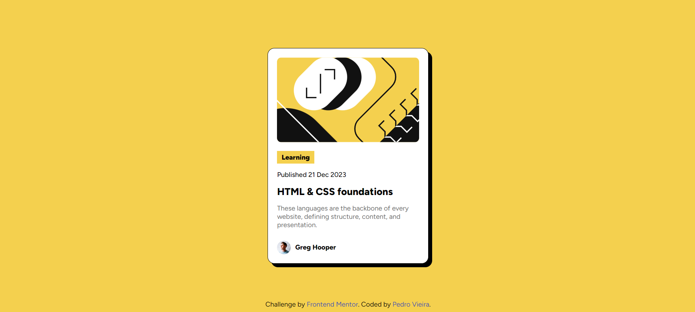

# Frontend Mentor - Blog preview card solution

This is a solution to the [Blog preview card challenge on Frontend Mentor](https://www.frontendmentor.io/challenges/blog-preview-card-ckPaj01IcS).

## Table of contents

- [Overview](#overview)
  - [The challenge](#the-challenge)
  - [Screenshot](#screenshot)
  - [Links](#links)
- [My process](#my-process)
  - [Built with](#built-with)
- [Author](#author)

## Overview

### The challenge

Users should be able to:

- See hover and focus states for all interactive elements on the page

### Screenshot

### Links

- Solution URL: [Solution](https://github.com/pedro-10-vieira/Frontend-Mentor/tree/master/blog-preview-card-main)
- Live Site URL: [Website](https://pedro-10-vieira.github.io/Frontend-Mentor/blog-preview-card-main/)

## My process

### Built with

- Semantic HTML5 markup
- CSS custom properties
- Flexbox

## Author

- Frontend Mentor - [@pedro-10-vieira](https://www.frontendmentor.io/profile/pedro-10-vieira)
- LinkedIn - [Pedro Vieira](https://www.linkedin.com/in/pedro-vieira-26637732b/)
